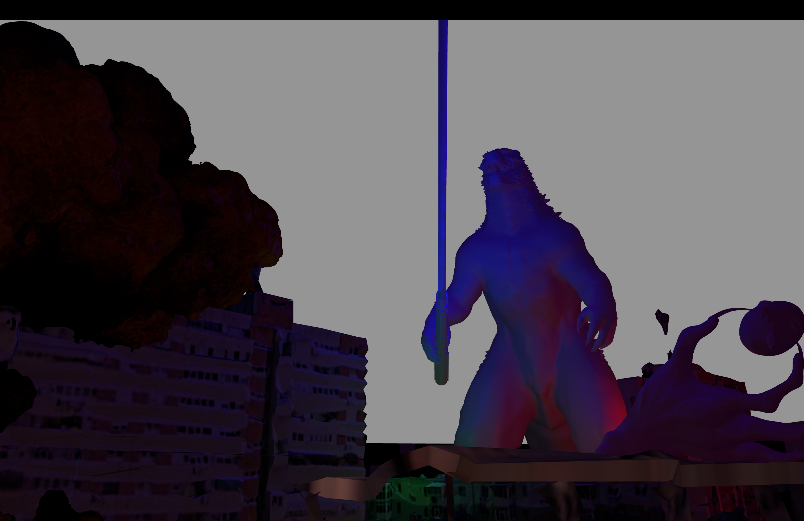
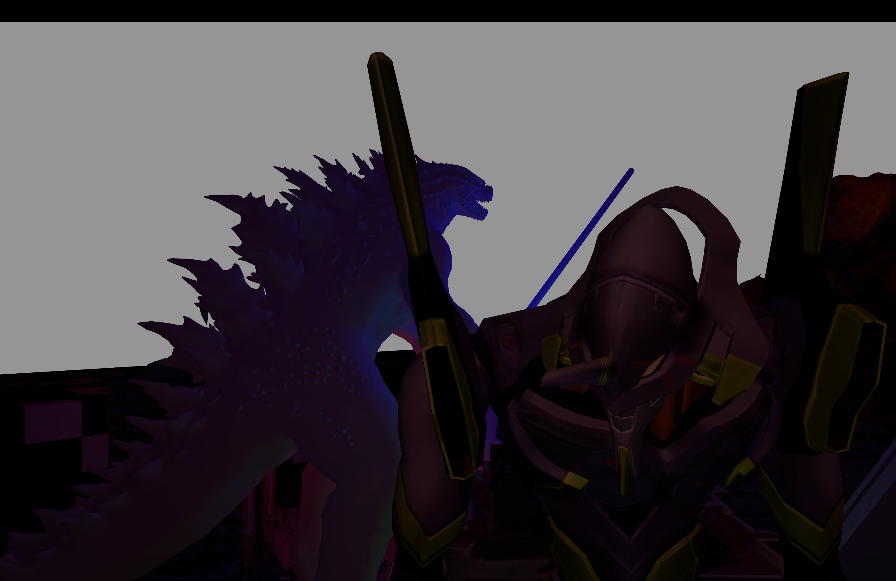
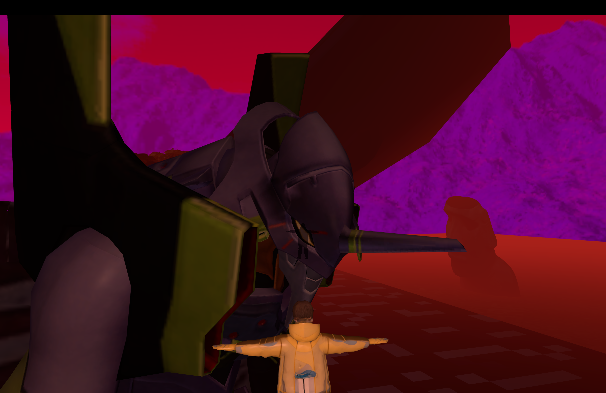
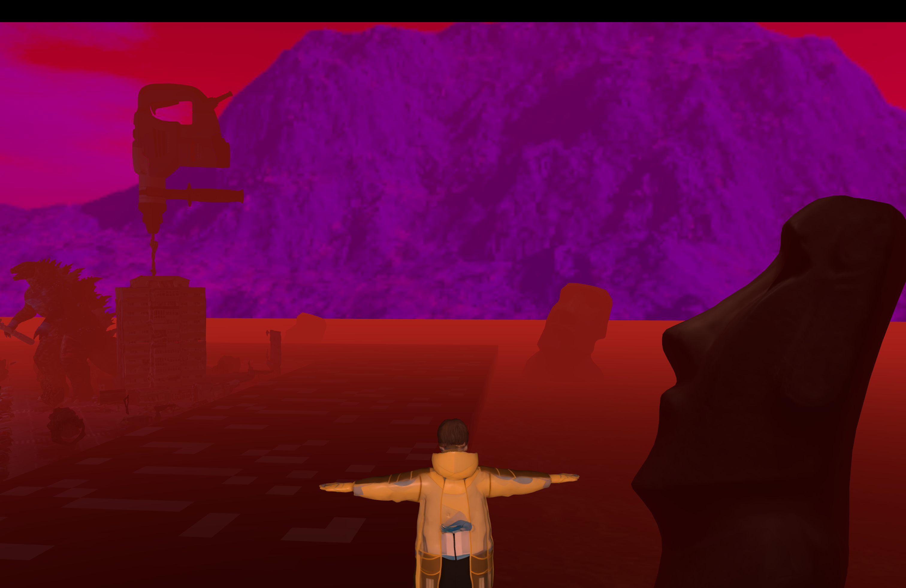

# utcn-OpenGL-FirstPersonGoArounder

Project for the third year Graphics Processing laboratory @ UTCN CTI

FPGA(first person go arounder)= an FPS(first person shooter) without shooting

*There is a player mmodel but the camera is first person still.

